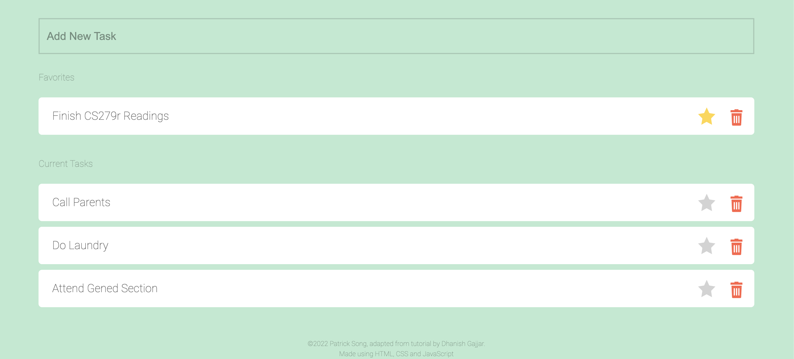

## A To Do Web App using Javscript, HTML, CSS



You can view the page at this [link](https://pcsong33.github.io/cs279r-todo-app/). In order to run the project locally, make sure that you have Node.js (and NPM) intalled.

### How to install Node.js

Links:

- [Node.js](https://nodejs.org/en/) homepage
- [NPM](https://www.npmjs.com/) homepage

Get Node.js and NPM (installed together):

- Debian / Ubuntu - based on [Node docs](https://github.com/nodesource/distributions/blob/master/README.md#installation-instructions).
- macOS - use a [Brew formula](https://formulae.brew.sh/formula/node).
    ```sh
    $ brew install node
    ```
- Windows
    - Download and run the Windows installer from the [Node.js Download](https://nodejs.org/en/download/) page.
- Other systems
    - Follow the [package manager](https://nodejs.org/en/download/package-manager/) instructions on the Node.js website.

Check installed versions:

- Node.js
    ```sh
    $ node --version
    v14.2.0
    ```
- NPM
   ```sh
   $ npm --version
   6.14.4
   ```
   
### How to run code locally

Right-click on the index.html file, and open the file with your preferred browser.

## App Features
- Add tasks by entering activities in the top box.
- Favorite tasks by clicking the star icon.
- Delete tasks by clicking the trash icon. 


